# 🌌 Premium Full-Stack Profile Card Studio

[](https://reactjs.org/)
[](https://nodejs.org/)
[](https://expressjs.com/)
[](https://vercel.com/)
[](https://opensource.org/licenses/MIT)

An advanced, highly customizable, and dark-mode-first Developer Profile Card built using functional React, Node.js + Express, and flat-file database storage. Features 4 unique visual layout themes and real-time Google Drive image URL resolving.

🌐 **Production Link:** [https://frontend-beryl-two-18.vercel.app](https://frontend-beryl-two-18.vercel.app)

---

## 🎨 Visual Showcase & Themes

Toggle between 4 custom templates in real-time right inside the editor to completely transform the card's visual identity:

### 1. 🔮 Glassmorphic Indigo (Default)
- **Vibe:** Sleek modern SaaS container.
- **Visuals:** High-blur backdrop-filters, subtle top-edge shimmer animations, floating ambient background glow blobs, and conic-gradient avatar rings.

### 2. ⚡ Cyberpunk Neon
- **Vibe:** Retro futuristic hacker space.
- **Visuals:** Grid pattern backdrop overlay, hot pink/cyan neon glowing borders, monospace typography badges, and sharp box-shadow details.

### 3. 📰 Minimalist Editorial
- **Vibe:** Quiet luxury architectural slate.
- **Visuals:** Pure flat dark slate container with strict fine borders, Georgia serif display headers, zero animation distractions, and high-end editorial alignment.

### 4. 🌿 Warm Organic
- **Vibe:** Earthy natural warmth.
- **Visuals:** Olive-sage dark backgrounds, terracotta CTA styling, warm cream badge outlines, and smooth organic card curves.

---

## ⚙️ Core Technical Features

### 🖼️ Auto Google Drive Image Converter
Normally, Google Drive image sharing URLs fail inside raw `` source tags. This project embeds a regex compiler in both the view and edit modes to parse documents, extract unique file IDs, and link them to direct CDN endpoints:
```javascript
const driveRegex = /(?:drive\.google\.com\/(?:file\/d\/|open\?id=)|docs\.google\.com\/file\/d\/)([a-zA-Z0-9_-]{25,})/;
// Automatically converts: https://drive.google.com/file/d/FILE_ID/view?usp=sharing
// Into direct source:  https://lh3.googleusercontent.com/d/FILE_ID
```

### ⚡ Real-Time Theme Rendering
The editor layout wraps in `<div className={`page-wrapper theme-${formData.template}`}>`. Clicking any visual theme selector instantly transforms the container, inputs, buttons, and backgrounds.

### 🛡️ Dirty-State Validation
The form calculates mutations dynamically against original database objects. The `Save` button automatically disables when no changes are present, preventing empty or redundant API queries.

---

## 🏗️ Architecture Flow

```mermaid
graph TD
    subgraph Client [React Frontend - Vercel]
        Page[ProfilePage / EditPage] --> Hook[useProfile Hook]
        Hook --> API[profileApi client]
    end

    subgraph Server [Express Backend - Localhost]
        API -- HTTP /api/profile --> ServerExpress[Express server.js]
        ServerExpress -- Read/Write --> Seed[profile.json Database]
    end
    
    style Client fill:#13161e,stroke:#6c63ff,stroke-width:2px;
    style Server fill:#0c0d10,stroke:#34d399,stroke-width:2px;
```



---

## 🚀 Running locally

### 1. Run the Backend API
```bash
cd profile-app/backend
npm install
npm start
```
*Port:* Runs on `http://localhost:5000` (seeds initial `profile.json` on startup).

### 2. Run the React Frontend
```bash
cd profile-app/frontend
npm install
npm start
```
*Port:* Launches on `http://localhost:3000`.

---

## 🎯 Design System Tokens

```css
:root {
  --clr-bg: #0d0f14;              /* Deep Navy Dark */
  --clr-surface: #13161e;         /* Glass Card Base */
  --clr-surface-2: #1a1e28;       /* Inputs & Buttons */
  --clr-border: rgba(255,255,255,0.07);
  --clr-accent: #6c63ff;          /* Electric Indigo */
  --clr-emerald: #34d399;         /* Active status & success toast */
  --clr-error: #ef4444;           /* Alert border & toast error */
  --ff-display: 'Instrument Serif', serif;
  --ff-body: 'DM Sans', sans-serif;
}
```

---

## ♿ Accessibility Standards
- **Screen Readers:** All interactive SVG shortcuts and edit anchors feature explicit `aria-label` tags.
- **Labels:** Text inputs are bound to structural `<label>` elements via `htmlFor`.
- **Motion Reduction:** Full support for `prefers-reduced-motion` media queries which stop conic-gradient loops, floating blobs, and keyframe transitions immediately.
